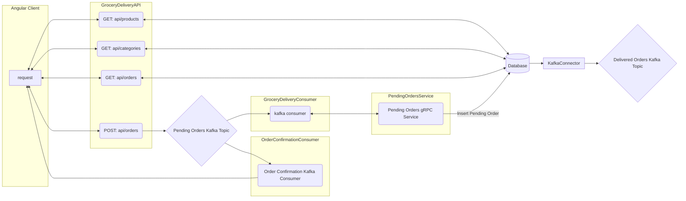

# grocery-delivery-service (Work in Progress)

Architecture:

```mermaid
flowchart LR;
    request <----> products;
    request <----> categories;
    request <----> getOrders;
    request <----> submitOrder;
    products <----> database;
    categories <----> database;
    getOrders <----> database;
    submitOrder --> pendingOrdersTopic;
    pendingOrdersTopic --> kafkaconsumer;
    pendingOrdersTopic --> orderConfirmationConsumer;
    kafkaconsumer <----> pendingOrdersGrpc;
    pendingOrdersGrpc -->|Insert Pending Order| database;
    orderConfirmationConsumer --> request;
    database --> KafkaConnector;
    KafkaConnector --> deliveredOrdersTopic;

    database[(Database)];
    pendingOrdersTopic{Pending Orders Kafka Topic};
    deliveredOrdersTopic{Delivered Orders Kafka Topic};

    subgraph Angular Client;
    request;
    end;
    subgraph GroceryDeliveryAPI;
    products(GET: api/products);
    categories(GET: api/categories);
    getOrders(GET: api/orders);
    submitOrder(POST: api/orders);
    end;
    subgraph GroceryDeliveryConsumer;
    kafkaconsumer(kafka consumer);
    end;
    subgraph PendingOrdersService;
    pendingOrdersGrpc(Pending Orders gRPC Service);
    end;
    subgraph OrderConfirmationConsumer;
    orderConfirmationConsumer(Order Confirmation Kafka Consumer);
    end;
    subgraph KafkaConnector;
    end;
```
