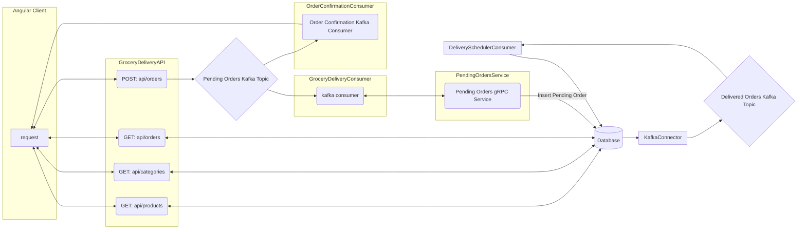

# grocery-delivery-service

## Introduction

This repository holds a distributed microservice application for a grocery delivery service that includes the following applications:

1. `grocery-delivery-frontend`
   - An Angular SPA application

2. `GroceryDeliveryAPI`
   - .NET 6 API that interacts with the front end application with the following endpoints:
     - *GET* `api/products/{categoryId}`
       - Retrieves grocery products from PostgresSQL database by a given category
     - *GET* `api/categories`
       - Retrieves all the available categories from the PostgresSQL database
     - *GET* `api/orders`
       - Retrieves all the orders that a client has placed
     - *POST* `api/orders`
       - Submits a pending grocery delivery through the system and returns an order number

3. `Order Confirmation Consumer`
   - .NET 6 Background Service Kafka Consumer application that reads from a Kafka Topic for Pending Orders that were placed and sends a confirmation message to the client via a _*SignalR*_ connection.

4. `Grocery Delivery Consumer`
   - .NET 6 Background Service Kafka Consumer application that reads from a Kafka Topic for Pending Orders that were placed and calls the Pending Orders gRPC service to schedule a pending order for delivery.

5. `Pending Orders Service`
   - .NET 6 gRPC service that takes a pending order and inserts it into the database.

6. `Delivery Scheduler Consumer`
   - .NET 6 Kafka Consumer application that reads messages from a Debezium PostgresSQL Kafka Topic for all the orders that are scheduled for delivery and sets a flag in the database marking an order as delivered.

## Architecture:



## How to Run

### Backend
1. With Docker running, navigate to the root folder (grocery-deliver-service) where the `docker-compose.yml` file is located.
2. Run the following command in the terminal to spin up the backend:
   ```
   docker-compose up -d --build
   ```

### Frontend
1. From a terminal, navigate to the following folder `grocery-delivery-frontend`
2. You must have Angular CLI installed. If you do not, run the following npm command to download it:
   ```
   npm install -g @angular/cli
   ```
3. From within the `grocery-delivery-frontent` directory, run the following command:
   ```
   ng serve -o
   ```
